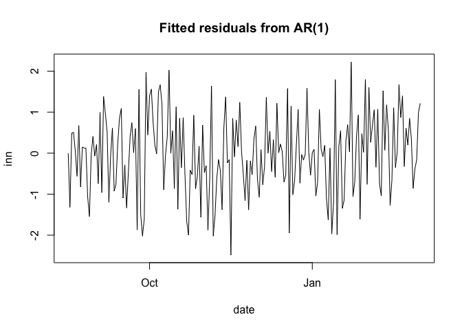

<!-- README.md is generated from README.Rmd. Please edit that file -->

# simults

<!-- badges: start -->

<!-- badges: end -->

The goal of simults is to simulate time series from various time series
models.

## Installation

You can install the development version of simults like so:

``` r
pak::pkg_install("leonfernandes/simults")
```

## Simulate Data

We demonstrate how to simulate an AR(1) below.

``` r
library(simults)

mdl <- make_arima(phi=0.3, theta=0, delta=0)
x <- simults(mdl, nsim=100, innov=rnorm(200))
plot(x, type='l', main="Simulated AR(1)")
```

 Currently
this package supports ARIMA and GARCH time series models from the
*smpspltools* package. Burn-in is done implicitly where sufficient
innovations are assumed to be supplied.

## Fitted Residuals

Fit an AR(1) model on first half of the data and compute residuals on
all the data.

``` r
phi_hat <- stats::ar(x$value[1:50], order.max=1)$ar
fit_mdl <- make_arima(phi=phi_hat, theta=0, delta=0)
z <- fitted_resid(fit_mdl, x)
plot(z, type='l', main="Fitted residuals from AR(1)")
```


